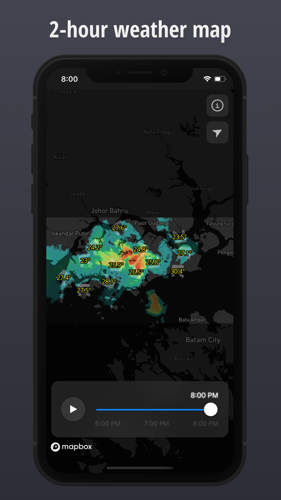

# Check Weather SG (native)

> ☀️🌧 Yet another weather app for Singapore

This is a native mobile app version of the [web app](https://github.com/cheeaun/checkweather-sg).

 

## Features

### **🌧 2-hour weather map**

Observe how the rain clouds move over time. Temperature (°C), Relative humidity (%) and rainfall (mm) measurements are displayed together with precipitation radar that is updated every 5 minutes to give better context of the past and forecast of the current weather conditions.

### **🔔 Periodic rain alerts**

Tap on ⓘ to enable rain alert notifications. Push notifications are sent every time there's significant rain cloud coverage over Singapore, from the beginning, all the way until the rain goes away. Notifications are sent periodically with coverage percentage information to give a sense of how the clouds move and how fast the rain goes by.

### **📡 Weather map in Today View**

Up-to-the-minute weather viewable on the Today widget. The latest rain precipitation radar and temperature (°C) information are always accessible and viewable in a simple swipe to the Today View from the Lock screen or the Home Screen. Way more useful than any other weather widgets that only show temperatures and fancy charts.

### **📡 Weather and radar map widget** (New for iOS 14+)

At-a-glance weather map widget viewable on the Home Screen and Today View. The latest rain precipitation radar and temperature (°C) information are always accessible and viewable in 3 widget sizes. Way more useful than any other weather widgets that only show temperatures and fancy charts.

## Setup

1. [Set up dev environment](https://reactnative.dev/docs/environment-setup) (Click on "React Native CLI Quickstart")
2. Navigate to this repository's directory
3. Run `npm i`
4. Run `npx pod-install`
5. [Add `GoogleService-Info.plist`](https://firebase.google.com/docs/ios/setup#add-config-file) to root folder
6. Run `npm start`

## Copyright & license

- Data
  - © [Data.gov.sg](https://data.gov.sg/privacy-and-website-terms#site-terms)
  - © [Meteorological Service Singapore](http://www.weather.gov.sg/terms-of-use)
  - © [National Environment Agency](http://www.nea.gov.sg/open-data-licence/)
- Code licensed under [MIT](https://cheeaun.mit-license.org/)
